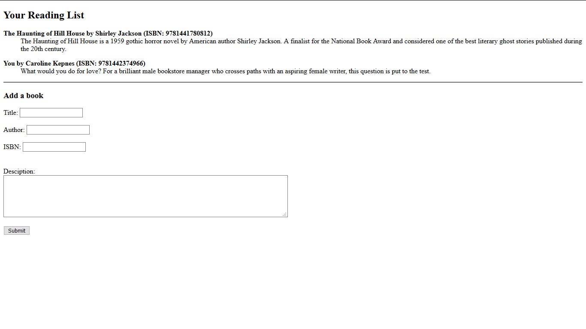

# Reading List

A very basic spring boot application for beginners with in-memory database. It gives a basic understanding of storing and retrieving of data from a database.

# Dependencies used

  - Web
  - JPA
  - H2 (in-memory DB)
  - Thymeleaf (template engine)
 
### Installation

### Step 1 :
```sh
$ git clone https://github.com/YoursSohail/ReadingList.git
```

### Step 2:
Open the extracted project in your favorite IDE or editor.

### Step 3:

Run the application *i.e. ReadingListApplication.java*

### Step 4:

Open http://localhost:8000/readingList to see the output.


*P.S.* 
*You can change the port number to default by removing "server.port = 8000" from application.settings file.*

*Don't enter the descripting more than 255 characters else it will show error as the length for the textarea is 255 characters.*

# Output


